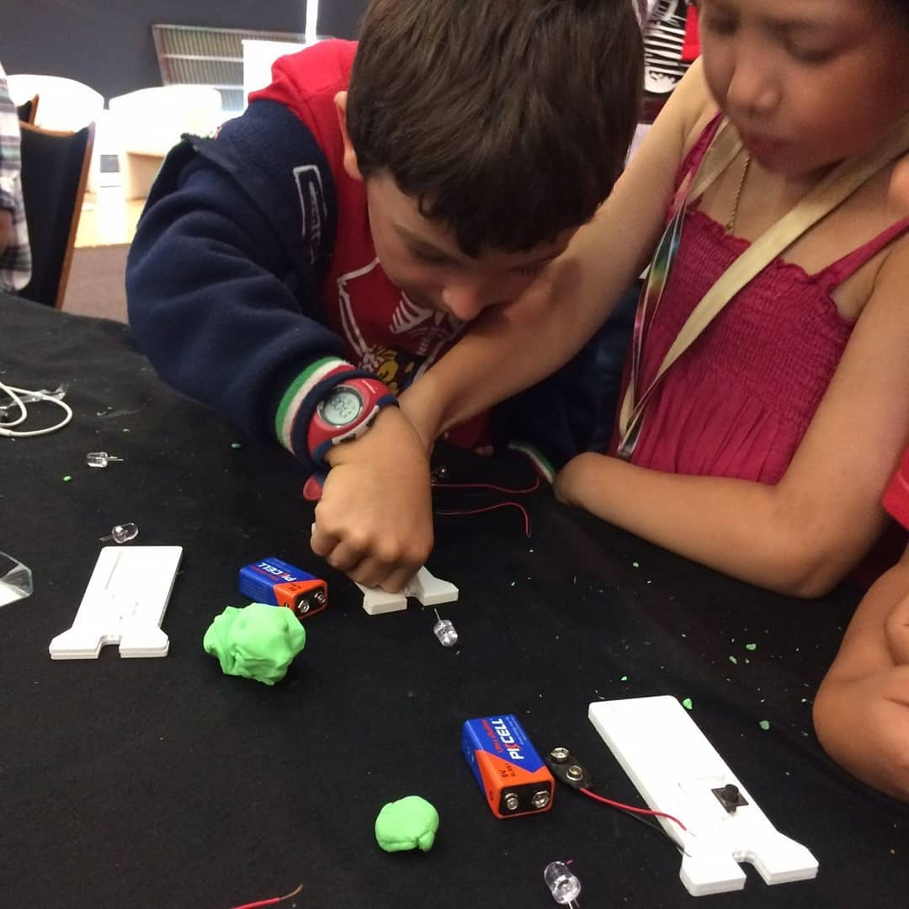
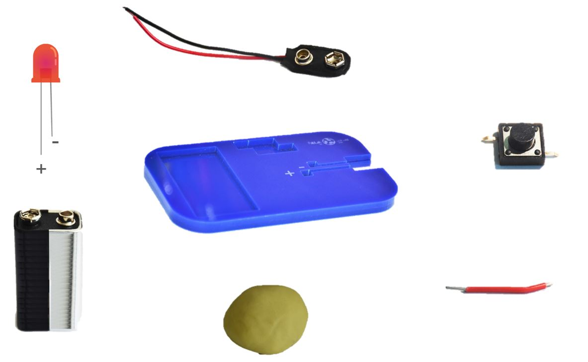

# PlydoughPCB

PlydoughPCB is open source project that is done in [Fablab UAE](fablabuae.ae). Its meant to introduce kids to the world of Printed Circuits Boards (PCBs) in safe and yet enjoyable way!

## Fabrication
- Laser cut the [fabricationfiles](fabricationFiles.dxf)
* Glue the two pieces together using acrylic glue or super glue depending on the material of choice.
* Gather the required components which are:
 * 9V Battery and snaper
 * 11 mm through hole LED
 * Small jumper wire
 * Through hole push button
 * playdough!

   

-  Mount the push button in its place by press it down gently

  

- Add plydough in the empty slots shown below

  

- Attach the battery snaper and insert the battery in its place

 

- Insert the LED in its assigned place while taking care of the + and - legs (- is the shortest!)

  

- Connect the battery + and - wires as follows (- to the input of the button and + to the LED +)

  

- Use the small jumper wire to connect the button output to the (-) terminal of the LED and you are done!

  

## License
  This work is licensed under a [Creative Commons Attribution-NonCommercial-ShareAlike 4.0 International License](https://creativecommons.org/licenses/by-nc-sa/4.0/).
